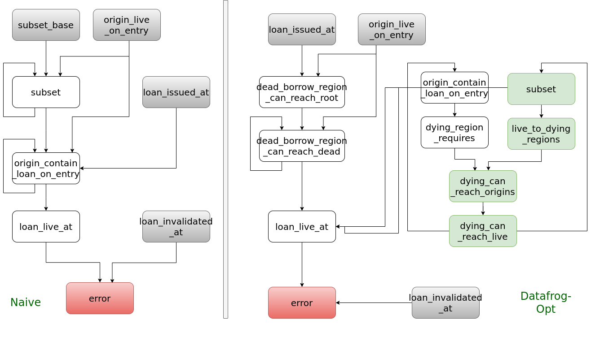
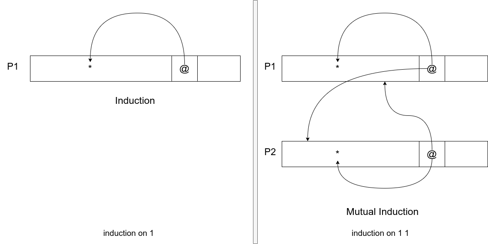
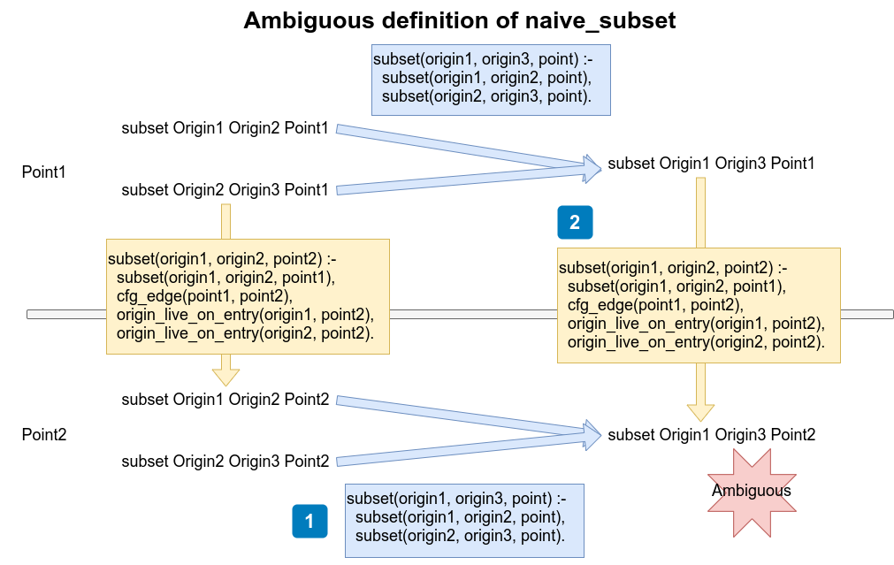
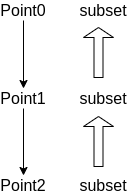

# **Use Abella to prove equivalence of datalog rules**

In Polonius (the new Rust borrow checker)

By YIJUN Leng 

<!-- 看到等价性，我马上就会想到 -->
<!-- 矩阵力学和波动力学的等价性 -->
<!-- lambda calculus 和 turing machine 的等价性 -->

<!-- 首先解释一下题目。。。 -->
<!-- 虽然有一个看上去很吓人的标题，不过背后原理不超过高中知识 -->
<!-- 众所周知，SJTUG是一个有着悠久PL传统的社团，形式化证明是我们这里的基础知识。 -->
<!-- 在座可能大多数都是第一次听SJTUG的pres,所以还是从传统领域的话题开始 -->

---
# Self introduction

vim
manjaro
ps aux (instead of ps -ef)

---
# Warm-up: Compile/Runtime error?
```
#include<iostream>     
#include<vector>
using namespace std;

int main(){                          fn main() {            
  vector<int> v={12};                    let mut v=vec![12];
  auto x=&v[0];                          let x=&v[0];
  cout<<*x<<endl;                        dbg!(x);
                                     
  v.reserve(100);                        v.reserve(100);
  cout<<*x<<endl;                        dbg!(x);
}                                    }                       
```

<!-- left cpp: can compile,  can't run -->
<!-- right rust: can't compile -->

---
# How Rust borrow checker(NLL) works
1. identify mutable/immutable borrow

```
1 fn main() {            
2     let mut v=vec![12];
3     let x=&v[0];
4     dbg!(x);
5     v.reserve(100);
6     dbg!(x);
7 }                       
```

---
# Lightly desugared

```
1 fn main() {            
2     let mut v=vec![12];
3     let x=&v[0];
4     dbg!(x);
5     Vec::reserve(&mut v, 100);
6     dbg!(x);
7 }                       
```

multiple **live** immutable borrows / one **live** mutable borrow 

mutable borrow: L5 
immutable borrow: L6 L5 L4

---
# How Rust borrow checker(NLL) works

1. identify mutable/immutable borrow
2. each borrow's live span (in lines)
3. check conflict (mutable borrow and immutable borrow at same line)

---
# The problem of NLL 

```rust
fn get_or_insert(
    map: &mut HashMap<u32, String>,
) -> &String {
    match map.get(&22) {
        Some(v) => v,
        None => {
            map.insert(22, String::from("hi"));
            &map[&22]
        }
    }
}
```

--- 

```
error[E0502]: cannot borrow `*map` as mutable because also borrowed as immutable
 --> src/main.rs:11:13
  |
3 |   map: &mut HashMap<u32, String>,
  |        - let's call the lifetime of this reference `'1`
4 | ) -> &String {
5 |   match map.get(&22) {
  |         --- immutable borrow occurs here
6 |     Some(v) => v,
  |                - returning this value requires `*map` is borrowed for `'1`
7 |     None => {
8 |       map.insert(22, String::from("hi"));
  |       ^^^^^^^^^^^^^^^^^^^^^^^^^^^^^^^^^^ mutable borrow occurs here
```

---

# Lightly desugared

```rust
fn get_or_insert<'a>(
    map: &'a mut HashMap<u32, String>,
) -> &'a String {
    match HashMap::get(&*map, &22) {
        Some(v) => v,
        None => {
            HashMap::insert(&mut *map, 22, String::from("hi"));
            &map[&22]
        }
    }
}
```
https://nikomatsakis.github.io/rust-belt-rust-2019/
https://www.youtube.com/watch?v=_agDeiWek8w&t=329s&ab_channel=RustBeltRustConference

---

# How Polonius work?

```rust
cargo  rustc  -- -Zpolonius
// or
rustc -Zpolonius main.rs 
```

Written in datalog(prolog) now.

Compiler team created two set of datalog rules: 
1. naive 
2. datafrog-opt

---


---


---


In practise, naive = datafrog-opt.

In logic, naive = datafrog-opt (not intuitively)

But how do we formally prove it?
(This problem is first proposed by me, and first solved by me.)


<!-- compiler emit a lot of facts: loan_issued_at, subset_base, .. -->
<!-- polonius take facts as input -->

--- 
# Steps
1. 
2. datafrog_opt_error => naive_error
3. naive_error => datafrog_opt_error


---
## Choose a proof assistant to express datalog rules

- Isabelle/Coq/Z3/CVC4/Yices
- Lean3 Lean4
- lambda prolog
  - Teyjus
  - ELPI(OCaml)
  - **Abella(OCaml)**: suitable to express datalog

A lot of under developing...

--- 
# Steps
1. use Abella to describe datalog
1.1 input
1.2 naive and datafrog-opt
2. datafrog_opt_error => naive_error
3. naive_error => datafrog_opt_error


---
# 1. Use Abella to describe datalog
```
Kind origin type.
Kind loan type.
Kind point type.

Type origin_live_on_entry origin -> point -> prop.
Type loan_issued_at origin -> loan -> point -> prop.
Type cfg_edge point -> point -> prop.
Type loan_invalidated_at loan -> point -> prop.
Type not_loan_killed_at loan -> point -> prop.
Type subset_base origin -> origin -> point -> prop.
```

---

# 1. Use Abella to describe datalog
```
Define  naive_subset: origin -> origin -> point -> prop,
        naive_origin_contains_loan_on_entry: origin -> loan -> point -> prop,
        naive_loan_live_at: loan -> point -> prop,
        naive_errors: loan -> point -> prop  by

naive_subset Origin1  Origin2  Point  :=
  subset_base Origin1  Origin2  Point ;

naive_subset Origin1  Origin2  Point2  :=
  exists Point1,
  naive_subset Origin1  Origin2  Point1 /\
  cfg_edge Point1  Point2 /\
  origin_live_on_entry Origin1  Point2 /\
  origin_live_on_entry Origin2  Point2 ;
...
```
---

# 1. Express negative in Abella

```
dead_borrow_region_can_reach_root Origin Point Loan :=
  loan_issued_at Origin  Loan  Point /\
  (origin_live_on_entry Origin  Point -> false) ;
```

---

# 1. Express Axiom in Abella
```
/* The only axiom introduced */
Theorem OriginLiveAxiom:
  forall Origin,     
  forall Point,       
  (origin_live_on_entry Origin Point ) \/ ( origin_live_on_entry Origin Point -> false). 
skip.
```
`skip` is the only way to express axiom.

---

# 2. datafrog_opt_error => naive_error

```
Theorem DatafrogOpt2Naive:
  forall Loan,
  forall Point,
  datafrog_opt_errors Loan Point ->
  naive_errors Loan Point.
```

---
# Two important inspection

```
/* Lemma24 */
datafrog_opt_subset Origin1 Origin2 Point 
=> naive_subset Origin1 Origin2 Point

/* Lemma26 */
datafrog_origin_contain_loan_on_entry Origin Loan Point
=> naive_origin_contains_loan_on_entry Origin Loan Point
```
<!-- 为什么第一个lemma就是24, 因为前面23个全错了 -->

---
# Prove Lemma24

```
Theorem Lemma24:
  (
    forall Point,
    forall Origin1,
    forall Origin2,
    datafrog_opt_subset Origin1 Origin2 Point ->
    naive_subset Origin1 Origin2 Point
  ) /\ (
    forall Point1,
    forall Point2,
    forall Origin1,
    forall Origin2,
    dying_can_reach Origin1 Origin2 Point1 Point2  ->
    naive_subset Origin1 Origin2 Point1
  ).
```

---



---
# 3. naive_error => datafrog_opt_error

Can we follow the trick before?
```
/* Lemma25 */
naive_subset Origin1 Origin9 Point
=> datafrog_opt_subset Origin1 Origin9 Point 

/* Lemma27 */
naive_origin_contains_loan_on_entry Origin Loan Point
=> datafrog_origin_contain_loan_on_entry Origin Loan Point
```

**WRONG!**

--- 
# Try applying small patches...

```
/* Lemma25 */
naive_subset Origin1 Origin9 Point
=> datafrog_opt_subset Origin2 Origin9 Point 

/* Lemma27 */
naive_origin_contains_loan_on_entry Origin9 Loan Point
=> datafrog_origin_contain_loan_on_entry Origin2 Loan Point
```

**STILL WRONG!**

Definitely, it's not trival to construct meaningful relationship from naive to datafrog-opt.

---

<!-- # Ambiguous definition of `naive_subset` -->



---
## Another example of ambiguous definition
### matched parens
```
# ambiguous definition
S := null | (S) | S S
```

`()()()=() ()()`
`()()()=()() ()`

```
# unambiguous definition
S := null | (S) S
```
---

# Why so diffculity ?
- `naive_subset` has no least fixed point.
- `naive_subset` should not extensible along Point
- What if `naive_subset` is defined as ...

```
subset(origin1, origin2, point2) :-
  subset(origin1, origin2, point1),
  cfg_edge(point1, point2),
  origin_live_on_entry(origin1, point2),
  origin_live_on_entry(origin2, point2).
```



---

## Redefine my_* with datafrog_opt_*


---
```
my_subset Origin1 Origin2 Point :- datafrog_opt_subset Origin1 Origin2 Point.
my_subset Origin1 Origin3 Point :-
  datafrog_opt_subset Origin1  Origin2  Point , 
  my_subset Origin2  Origin3  Point .
```

are similar to the classical recursive type definition:

```
Kind list type.

Type empty list.
Type cons nat -> list -> list.
```
--- 

```
my_subset Origin1 Origin2 Point :- datafrog_opt_subset Origin1 Origin2 Point.
my_subset Origin1 Origin3 Point :-
  datafrog_opt_subset Origin1  Origin2  Point , 
  my_subset Origin2  Origin3  Point .
```

```
# naive
subset(origin1, origin2, point) :- subset_base(origin1, origin2, point).

subset(origin1, origin2, point2) :-
  subset(origin1, origin2, point1),
  cfg_edge(point1, point2),
  origin_live_on_entry(origin1, point2),
  origin_live_on_entry(origin2, point2).

subset(origin1, origin3, point) :-
  subset(origin1, origin2, point),
  subset(origin2, origin3, point).
```

--- 

# Steps
1. use Abella to describe datalog
1.1 input
1.2 naive and datafrog-opt
2. datafrog_opt_error => naive_error (100 LOC)
3. naive_error => datafrog_opt_error (400 LOC)


---
## Reaction from Rust community

https://rust-lang.zulipchat.com/#narrow/stream/186049-t-compiler.2Fwg-polonius/topic/Prove.20equivalence.20between.20.20naive.20and.20datafrog-opt

---
# Conclusion

We prove two algorithms in Polonius produce the same result, based on only one axiom.

## Main tactic

(mutual) induction

--- 
# Benefit from this proof

naive = datafrog-opt is not coincidence.

Improve interpretability of prolog.

We don't need to test the correctness of datafrog-opt any more.
We only need to test the implementation correctness.

Helpful to verify new datalog rules before implementation.

---
## Future work
1. Another approach to prove?
2. polonius.next

## Personal future work 
1. Work on relationship between mlsub(2017) and ml-simple(2020)
2. Make Polonius the default borrow checker of Rust

---
# Reference

Null

---

## Express negative in Intuitionistic Logic

```
H1: origin_live_on_entry Origin Point 
H2: origin_live_on_entry Origin Point -> false
```
We can use `search` tactic to get false quickly.

Negative of `a` is `a -> false`.
Negative of negative of `a` is `(a -> false) -> false`.

`a => ( (a -> false) -> false ) ` ✓
`( (a -> false) -> false ) => a` 𐄂


---
# How to express three mutually exclusive states?
```
a
a -> false /\ b
a -> false /\ b -> false
```

```
a -> false
a /\ b
a /\ b -> false
```

---

# Paradox in Abella (Liar Paradox)
<!-- 罗素悖论 -->

Both true and false!
Abella will give a warning.

```
Define p : prop by
p := p -> false .

Theorem p_true : p .
unfold . intros . case H1 ( keep ) . apply H2 to H1 .

Theorem notp_true : p -> false .
intros . case H1 ( keep ) . apply H2 to H1 .
```


---

## Why we need proof assistant?
- Succinctness
- Repeatability
- Discover problem in proof
  four-color theorem
<!-- 四色定理的证明在11年之后被发现有错误 -->
<!-- 证明完之后，我一次都没有复查过逻辑，因为我知道一定是对的 -->

## But Abella can't prove all truth !
Gödel's incompleteness theorems 

---

# Polonius can't deal with 1
```
struct S;

fn main() {
    let s=S;
    let mut v:Vec<&S>=vec![];
    v.push(&s);
    v.pop();
    drop(s);
    // although v has remove the last element,
    // but still throw error
    v;
}
```

---

# Polonius can't deal with 2

```
use std::collections::binary_heap::BinaryHeap ;

fn main() {
    let mut heap = BinaryHeap::new();
    if let Some(_) = heap.peek_mut() {
        heap.push(4);
    };
}
```

THINKING: compare with P7

https://github.com/rust-lang/rust/issues/70797

---

# Polonius can't deal with 3

```
1 fn main() {
2     let mut z = 44;
3     let mut x = vec![&22];
4     let y = x[0];
5     x[0] = &z;
6     z = 1;
7     y;
8 }
```

Will be fixed in polonius.next

---

# Polonius can't deal with 4

```
fn main() {
  let a = 1;
  let mut b = 2;

  let mut aa = &a;
  let x = &*aa;

  std::mem::replace(&mut aa, &b); 
  b = 1;

  x;
}
```

Will be fixed in polonius.next

---
# What else can Polonius help?
Static program analysis: safe move

1. [prusti-dev](https://github.com/viperproject/prusti-dev)
2. clippy

https://github.com/rust-lang/rust-clippy/issues/7459

https://github.com/rust-lang/rust-clippy/issues/7512

[redundant_clone](https://rust-lang.github.io/rust-clippy/master/index.html#redundant_clone)

---

## Prolog engines
1. souffle (C++): parallel. Rust is using
2. [DDlog](https://github.com/vmware/differential-datalog) (Rust)
3. datafrog
4. swi (C/C++)

<!-- can delelte a fact  -->
<!-- but no negative？ -->
5. [racket]( https://docs.racket-lang.org/datalog/Tutorial.html )

6. bddbddb (java): use binary decision diagram. Rely on NP problem.
7. gnu-prolog gprolog (C)
8. scryer-prolog (Rust)

---
# Prolog engines


---

|        | Souffle                                         | DDlog                                                        |
| ------ | ----------------------------------------------- | ------------------------------------------------------------ |
| 优点   | 1. nice profiler<br/>2. builtin provenance      | 1. In Rust. Easy to compile for wasm, cross-compile</br>     |
| 缺点   | 1.  链接问题<br/>2. lacks first-class data type | 1. lack disjunction (DNF)<br/>2. overhead due to incremental capacities<br/>3. bad frontend |
| 支持者 | lqd                                             | bjorn3, Dylan MacKenzie (ecstatic-morse), Domenic Quirl      |

---
# Q&A

Full proof and ppt here: 
https://github.com/lengyijun/polonius-abella

Welcome to reviewing.


